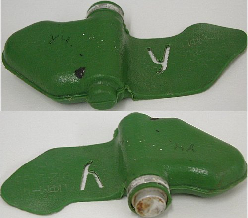

# PFM-1 Mine Detection using Fast-R-CNN



## About the Project

### Getting Started

To get started

1. Clone the Repository

```bash
  git clone https://github.com/Lihemen/pfm1-mine-f-rcnn.git
```

2. Create Virtual Environment

```bash
  python3 -m venv venv
```

or (python version 3.11.x)

```bash
  python -m venv venv
```

3. Enable Virtual Environment

Mac or Linux

```bash
  source ./venv/bin/activate
```

Windows Bash

```bash
  source venv/Scripts/activate
```

Windows Powershell

```bash
  Set-ExecutionPolicy -ExecutionPolicy Bypass -Scope Process -Force
```

```bash
  .\venv\Scripts\activate.ps1
```

4. Install Dependencies

```bash
  pip install -r requirements.txt
```

5. Running the project

Open your terminal and write the command

```bash
  python3 main.py
```
